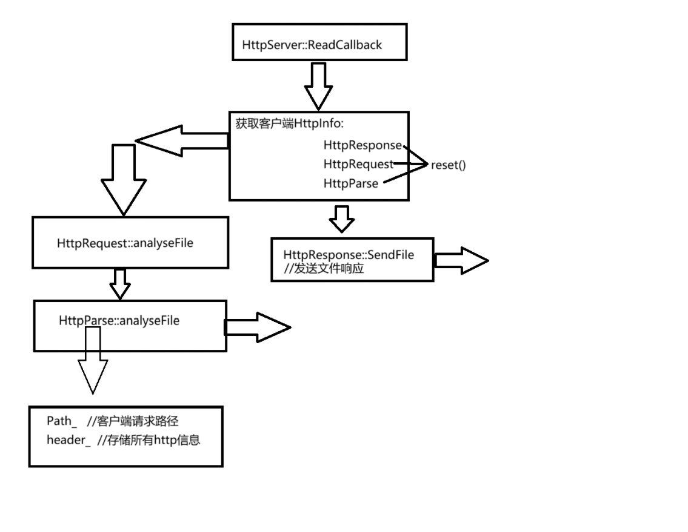

## HttpServer 模块工作流程

### 1. 服务器初始化

- `HttpServer` 类在实例化时执行初始化操作，包括创建主事件循环 `loop_` 和 TCP 服务器 `tcpServer_`。
- `tcpServer_` 会在主事件循环 `loop_` 中启动，以接受客户端连接。

### 2. 启动服务器并监听连接

- 调用 `HttpServer::run()` 启动服务器。
- `TcpServer` 开始在主事件循环中监听客户端的连接请求。每当有新的连接，`TcpServer` 会调用注册的回调函数 `ReadCallback()` 来处理客户端请求。

### 3. 处理客户端请求

- `ReadCallback(Pine::clientPtr t, Buffer* inputBuffer)` 是服务器核心处理逻辑，负责解析客户端发来的 HTTP 请求。
- 当 `tcpServer_` 检测到新的数据到来时，`ReadCallback` 会被调用：
  - 从 `inputBuffer` 中读取数据，并将其解析为 HTTP 请求，存储在 `HttpInfo` 对象中。
  - 根据 HTTP 请求的方法（如 POST），调用适当的回调函数。若是 POST 请求，则调用 `postCallback_` 处理。

### 4. 自定义请求处理回调

- `HttpServer` 提供 `setPostReadCallback()` 用于设置自定义 POST 请求的回调函数。
  - 用户可以通过 `HttpCallback::setPostCB()` 注册处理特定路径的回调处理函数。
  - 这些回调函数会根据请求路径选择不同的处理逻辑，完成业务功能。

### 5. HTTP 响应发送

- 回调函数处理完成后，根据 `HttpInfo` 的内容构建 HTTP 响应。
- 构造响应后，服务器将响应写回到 `TcpClient`，然后将数据发送给客户端，完成一次 HTTP 交互。

---
